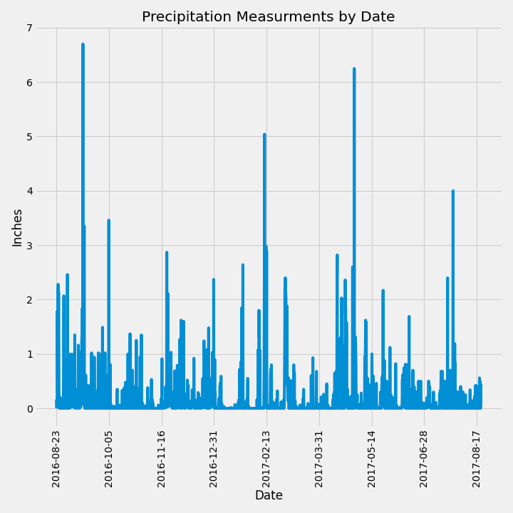
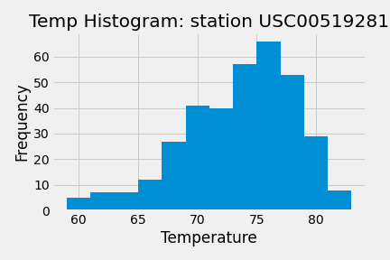

# SQLAlchemy Homework - Surfs-Up
### David Fournie
#### 1/25/2021

####
### Step 1 - Climate Analysis and Exploration
Using hawaii.sqlite as a base for queries, we found that 2017-08-23 was the final date in the database. Since we wanted to look at the precipitation for the final 12 months of the dataframe, our starting point was determined to be 2016-08-23. By selecting the date and prcp values from hawaii.squlite we were able to plot the data as a bargraph:

 ####
 This let us see amounts of precipitation throughout the final year. All in all the rain followed typical patterns for an area that has rainy seasons. The late summer/early fall, and spring values were higher than their winter & summer counterparts. One unintended conclusion of the data is that if you hate rain, the time to visit Hawaii is in the non-rainy seasons.
 ###
The next phase of the climate analysis step was to find which weather station in hawaii.sqlite had the most observations. USC00519281 AKA WAIHEE 837.5, HI US was the most active station in our data set. Looking at the temperature data  for USC00519281 in the last recorded year revealed that the max temp was 85 degrees, the min temp was 54 degrees, and the avg temp was 72 degrees. Plotting the data in a histogram revealed the most frequent temperatures occured in the low to mid 70's which fits with the measured avg temp.

####
### Step 2 - Climate App
We created a companion App that breaks the data down into lists and dictionaries.
in order to access the app, run  app.py in vs code. This will grant access to a development server. clicking on the local link provided will take you to the home page. Here is an example: http://127.0.0.1:5000/.

The first three links available provide access to precipitation, station, and temperature data. In order to access these links, simply copy and paste the link text on the homepage to the end of the home url. For instance, if you wanted to access precipitation data for station USC00519281 , the link would look like this: http://127.0.0.1:5000/api/v1.0/precipitation

The first three links work the same as the example above.

The last two links allow for user input of a date in the dataframe of their choosing. In order to accomplish this replace the START and or END in the links with the date of your choice. The date(s) must be in the yyyy-mm-dd format and the date range is from 2010-01-01 to 2017-08-23. 

Example for one date: http://127.0.0.1:5000/api/v1.0/2015-09-16 
This returns the avg temp, max temp, and min temp, the all the temps collected from 2015-09-16 to the end of the database.

Example for date range:http://127.0.0.1:5000/api/v1.0/2015-09-16/2016-09-16.
This returns the avg temp, max temp, and min temp, the all the temps collected between 2015-09-16 and 2016-09-16 inclusive. Happy exploring!
